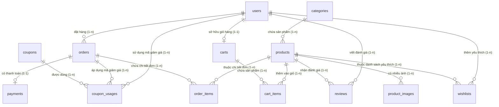

# BÁO CÁO ĐỒ ÁN MÔN HỌC
## ĐỀ TÀI: WEBSITE BÁN HOA TƯƠI (FLORAL SHOP)

---

## 1. MÔ TẢ ĐỀ TÀI

**Floral Shop** là một hệ thống website thương mại điện tử chuyên cung cấp các sản phẩm hoa tươi, quà tặng từ hoa. Hệ thống được thiết kế và phát triển nhằm mang lại trải nghiệm mua sắm hoa tươi trực tuyến nhanh chóng, tiện lợi cho khách hàng, đồng thời cung cấp công cụ quản lý toàn diện cho người quản trị cửa hàng.

### Công nghệ sử dụng:
* **Backend:** Laravel 11, PHP 8.2+
* **Frontend:** Blade Template, Bootstrap 5.3, Bootstrap Icons, Axios (AJAX)
* **Database:** MySQL / SQLite
* **APIs tích hợp:** Cổng thanh toán trực tuyến VNPay Sandbox, API Tỷ giá hối đoái thời gian thực (Exchange Rate API)

---

## 2. SƠ ĐỒ THIẾT KẾ HỆ THỐNG

### 2.1. Sơ đồ Quan hệ Thực thể (ERD - Entity Relationship Diagram)

Sơ đồ mô tả các thực thể (bảng) trong cơ sở dữ liệu và mối liên kết logic giữa chúng:

### 2.2. Sơ đồ Ca sử dụng (UML Use Case Diagram)

Sơ đồ phân rã các nhóm hành vi của từng tác nhân trên hệ thống:

```mermaid
graph TD
    %% Actors
    Guest[Khách vãng lai]
    Customer[Khách hàng thành viên]
    Admin[Quản trị viên]

    %% Guest Use Cases
    UC1(Xem danh sách/chi tiết sản phẩm)
    UC2(Tìm kiếm & Lọc sản phẩm)
    UC3(Đăng ký / Đăng nhập)

    %% Customer Use Cases
    UC4(Quản lý giỏ hàng)
    UC5(Áp dụng Coupon bằng AJAX)
    UC6(Thanh toán đơn hàng - COD/VNPay/Chuyển khoản)
    UC7(Quản lý Hồ sơ cá nhân)
    UC8(Xem lịch sử đơn hàng & Hủy đơn)
    UC9(Đánh giá sản phẩm - Reviews)
    UC10(Quản lý danh sách yêu thích - Wishlist)

    %% Admin Use Cases
    UC11(Xem thống kê Dashboard)
    UC12(Quản lý sản phẩm - CRUD)
    UC13(Quản lý danh mục - CRUD)
    UC14(Quản lý mã giảm giá - CRUD)
    UC15(Quản lý người dùng - CRUD & Khóa tài khoản)
    UC16(Quản lý đơn hàng & Cập nhật trạng thái)

    %% Connections
    Guest --> UC1
    Guest --> UC2
    Guest --> UC3

    Customer --> UC4
    Customer --> UC5
    Customer --> UC6
    Customer --> UC7
    Customer --> UC8
    Customer --> UC9
    Customer --> UC10

    Admin --> UC11
    Admin --> UC12
    Admin --> UC13
    Admin --> UC14
    Admin --> UC15
    Admin --> UC16
```

---

## 3. DANH SÁCH CHỨC NĂNG CHÍNH ĐÃ HOÀN THÀNH

### 3.1. Chức năng phía Khách hàng (Client Front-end)
1. **Trang chủ (Homepage):** Hiển thị danh mục hoa nổi bật, sản phẩm mới nhất, sản phẩm đang giảm giá (Flash Sale) và ý kiến đánh giá từ khách hàng cũ.
2. **Cửa hàng (Shop):**
   * Tìm kiếm sản phẩm theo từ khóa (tên, mô tả sản phẩm).
   * Lọc sản phẩm theo danh mục hoa.
   * Sắp xếp sản phẩm theo giá tăng dần, giá giảm dần, mới nhất.
   * Phân trang sản phẩm (12 sản phẩm mỗi trang).
3. **Chi tiết sản phẩm:** Xem hình ảnh, giá gốc, giá khuyến mãi, mô tả sản phẩm, số lượng tồn kho. Đọc đánh giá và chấm điểm sao trung bình.
4. **Giỏ hàng (Cart):** Thêm sản phẩm, điều chỉnh số lượng (tự động cập nhật tổng tiền thông qua PHP gửi form), xóa sản phẩm, xóa sạch giỏ hàng.
5. **Thanh toán (Checkout):**
   * Nhập thông tin giao hàng: Họ tên, Email, Số điện thoại (có validation định dạng regex Việt Nam), Địa chỉ giao hàng.
   * Chọn phương thức thanh toán: COD (Thanh toán khi nhận hàng), Chuyển khoản giả lập (Hiển thị mã QR động kèm tổng tiền thanh toán), VNPay API (Thanh toán trực tuyến bằng thẻ ngân hàng).
6. **Hủy đơn hàng (Cancel Order):** Khách hàng có thể tự hủy đơn hàng từ trang Lịch sử đơn hàng nếu đơn hàng **chưa được giao thành công** (trạng thái khác `delivered` và `cancelled`). Khi hủy, hệ thống tự động:
   * Cập nhật trạng thái đơn hàng và trạng thái thanh toán sang `cancelled`.
   * Hoàn trả số lượng sản phẩm vào kho hàng (stock).
   * Thu hồi lượt sử dụng và xóa bản ghi sử dụng của mã giảm giá (coupon) để khách hàng có thể sử dụng lại mã đó.
7. **Hồ sơ cá nhân:** Cập nhật thông tin cá nhân, đổi mật khẩu, xem danh sách đơn hàng đã mua và quản lý danh sách yêu thích (Wishlist).

### 3.2. Chức năng quản trị (Admin Panel)
1. **Dashboard:** Thống kê các chỉ số kinh doanh quan trọng (Tổng doanh thu đơn hàng thành công, tổng số đơn hàng, số khách hàng đăng ký, số sản phẩm đang hoạt động). Hiển thị bảng danh sách 10 đơn hàng mới nhất.
2. **Quản lý Sản phẩm (CRUD):** Thêm mới sản phẩm, sửa thông tin, tải lên hình ảnh, cập nhật tồn kho, giá bán, giá sale và xóa sản phẩm.
3. **Quản lý Danh mục (CRUD):** Thêm mới danh mục hoa, mô tả, tải lên ảnh đại diện cho danh mục, cập nhật và xóa danh mục.
4. **Quản lý Mã giảm giá (CRUD):** Thêm mã giảm giá (dạng % hoặc trừ tiền cố định), thiết lập hạn mức, thời gian hiệu lực, mô tả và giới hạn lượt dùng.
5. **Quản lý Người dùng (CRUD):** Xem danh sách tài khoản khách hàng, sửa quyền hạn (Admin/Customer), thực hiện Khóa (Block) hoặc Mở khóa (Unblock) tài khoản người dùng.
6. **Quản lý Đơn hàng:** Xem danh sách đơn hàng phân trang, cập nhật trạng thái đơn hàng (Chờ xử lý, Đã xác nhận, Đang giao, Đã giao, Hủy) và cập nhật trạng thái thanh toán.

---

## 4. CÁC TÍNH NĂNG SÁNG TẠO & MỞ RỘNG (GHI ĐIỂM TỐI ĐA)

### 4.1. Tải lên tệp tin (Upload File)
Hệ thống tích hợp upload hình ảnh sản phẩm và danh mục lên server lưu trữ ở thư mục `storage/app/public` sử dụng File Storage của Laravel, hỗ trợ validation định dạng file ảnh `.jpeg, .png, .jpg, .gif` và giới hạn kích thước tối đa 2MB.

### 4.2. Sử dụng AJAX (Asynchronous JavaScript and XML)
Tích hợp thư viện Axios ở phía client để gửi yêu cầu áp dụng **Mã giảm giá (Coupon)** trong trang giỏ hàng. Khi mã được nhập và áp dụng thành công, hệ thống sẽ tính toán lại số tiền giảm và tổng số tiền phải trả ngay tại chỗ mà không cần tải lại toàn bộ trang, mang lại trải nghiệm mượt mà.

### 4.3. Tích hợp API bên ngoài (External API)
1. **Cổng thanh toán VNPay:** Tích hợp bộ thư viện VNPay Sandbox cho phép người dùng thanh toán online. Đơn hàng sau khi thanh toán thành công qua cổng VNPay sẽ được cập nhật trạng thái thanh toán tự động (`paid`) trên hệ thống.
2. **API Tỷ giá hối đoái thời gian thực (VND ⇄ USD):** Tích hợp dịch vụ tỷ giá hối đoái thông qua API `https://open.er-api.com/v6/latest/VND`. Khách hàng trên trang chủ, cửa hàng và giỏ hàng có thể chuyển đổi nhanh hiển thị giá tiền giữa đồng Việt Nam (đ) và Đô la Mỹ ($) theo tỷ giá thị trường thực tế.

### 4.4. Tối ưu hóa hệ thống (Optimization)
* **Caching:** Tỷ giá hối đoái USD được lưu cache ở phía Backend Laravel trong **12 giờ** và lưu cache ở Local Storage phía Client trong **1 giờ** nhằm giảm tối đa độ trễ tải trang và tiết kiệm tài nguyên hệ thống.
* **Database Indexing:** Tạo index cho các cột tìm kiếm thường xuyên như `email`, `role`, `status` trong cơ sở dữ liệu giúp tăng tốc độ truy vấn.
* **Eager Loading:** Sử dụng `with()` và `withCount()` trong Eloquent ORM để giải quyết triệt để lỗi truy vấn trùng lặp N+1 Query.

---

## 5. HƯỚNG DẪN CHỤP ẢNH MÀN HÌNH MINH HỌA (SCREENSHOTS)

Để báo cáo sinh động, bạn nên chụp và chèn hình ảnh tại các phần sau trong hệ thống:
1. **Trang chủ (Home Page):** Giao diện Bootstrap phối màu hồng-trắng tinh tế.
2. **Trang Shop:** Phần tìm kiếm, lọc danh mục và phân trang sản phẩm dưới chân trang.
3. **Trang Giỏ hàng:** Minh họa lúc áp dụng mã giảm giá thành công bằng AJAX.
4. **Trang Thanh toán:** Biểu mẫu điền thông tin và lựa chọn các phương thức thanh toán.
5. **Trang Lịch sử đơn hàng:** Minh họa nút "Hủy Đơn" và các trạng thái đơn hàng.
6. **Admin Dashboard:** Bảng điều khiển tổng quan với các biểu đồ, con số thống kê và 10 đơn hàng gần nhất.
7. **Quản lý Sản phẩm Admin:** Bảng liệt kê danh sách sản phẩm kèm nút hành động.
